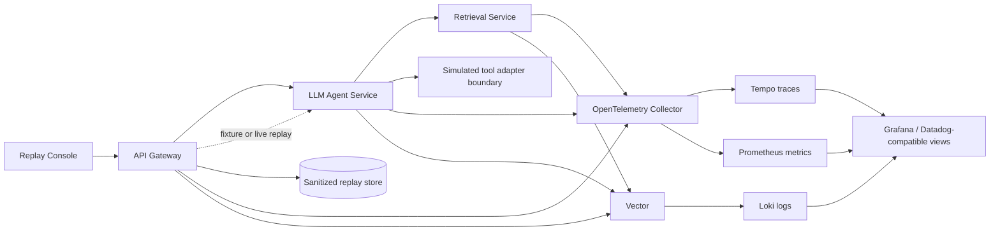

# SpanReplay

[](https://github.com/Victoria824/SpanReplay/actions/workflows/ci.yml)
[](https://github.com/Victoria824/SpanReplay/actions/workflows/codeql.yml)
[](LICENSE)
[](https://opentelemetry.io/)

**OpenTelemetry observability and privacy-aware failure replay for production AI agents.**

SpanReplay is an executable reference stack for diagnosing LLM and agent workflows across service boundaries. It combines distributed traces, structured logs, AI-specific metrics, SLOs, controlled failure injection, and deterministic replay in one local environment.

It is intentionally vendor-neutral. The default stack uses OpenTelemetry, Tempo, Prometheus, Loki, Vector, and Grafana; an optional Datadog path includes importable dashboards, monitors, and Terraform.

> No model API key is required. The incident lab is deterministic, so every failure can be reproduced in CI and during an interview demo.

## What it proves

- End-to-end context propagation across an API gateway, agent service, retrieval service, and tool boundary.
- AI telemetry for model/provider, prompt version, tokens, estimated cost, retrieval relevance, tool outcomes, validation failures, retries, and replay status.
- Nine reproducible scenarios: healthy, retrieval timeout/saturation, irrelevant grounding, provider timeout, tool failure, grouped unhandled exception, policy failure, and cost spike.
- Privacy-aware replay records with secret redaction, raw-content retention disabled by default, strict trace identifiers, and atomic file writes.
- Operational artifacts: Grafana and Datadog dashboards, alert rules, SLOs, Kubernetes manifests, Terraform, incident playbooks, and CI.
- Auth0/OIDC tenant isolation and viewer/operator/admin authorization with replay audit events.
- Reusable Node observability SDK plus an executable service-manifest conformance gate.
- Measured retrieval saturation experiment, load shedding, and a telemetry-backend outage Game Day.
- Multi-architecture, non-root containers with SBOM/provenance plus AWS/Datadog account bootstrap boundaries.

## Architecture



## Fastest demo: no Docker, no API key, no ports

```bash
npm install
npm run demo
```

This runs four workflows in process, persists redacted replay fixtures to a temporary directory, replays a tool failure, and prints the comparison.

## Full local stack

Requirements: Docker Engine with Compose v2.

```bash
cp .env.example .env
docker compose up --build
```

Then open:

- Replay Console: <http://localhost:4173>
- Grafana: <http://localhost:3000>
- Prometheus: <http://localhost:9090>
- Tempo API: <http://localhost:3200>

Select a failure scenario, run it, inspect the correlated trace/log/metrics view, and replay the stored evidence. The Console also has a zero-key static preview if the services are unavailable.

For Colima and Kubernetes instructions, see the [deployment guide](docs/deployment.md).
For protected GitHub Environments, AWS OIDC bootstrap, and Datadog keys, follow [cloud account setup](docs/cloud-account-setup.md).

## API walkthrough

```bash
curl -s http://localhost:4000/api/workflows \
  -H 'content-type: application/json' \
  -d '{"question":"How should we respond to an LLM provider timeout?","scenario":"tool-error"}'

curl -s http://localhost:4000/api/replays

curl -s http://localhost:4000/api/replays/<trace-id> \
  -H 'content-type: application/json' \
  -d '{"mode":"fixture"}'

# Replay the same evidence against a candidate execution profile.
curl -s http://localhost:4000/api/replays/<trace-id> \
  -H 'content-type: application/json' \
  -d '{
    "mode":"fixture",
    "promptVersion":"support-agent-v2",
    "configVersion":"strict-v2",
    "codeVersion":"current",
    "overrides":{"toolOutcome":"recorded"}
  }'
```

Fixture replay re-executes the complete agent state machine through recorded
`RetrievalAdapter`, `ModelAdapter`, and `ToolAdapter` outcomes. The version fields select a
registered execution profile; unsupported code versions are rejected instead of silently
falling back. The comparison returns `driftDetected` plus per-dimension changes for status,
answer, tool path, validation, cost, prompt, configuration, and code version.

## Signals and operational semantics

| Signal | Examples | Why it matters |
| --- | --- | --- |
| Traces | agent invocation, retrieval, model call, tool call, replay step | Identifies the failed dependency and critical path |
| Metrics | workflow duration/status, token use, estimated cost, relevance, tool outcomes | Drives alerts, SLOs, capacity, and cost controls |
| Logs | `trace_id`, service, environment, failure category, prompt version | Correlates evidence without relying on raw prompts |
| Replay | original trace, sanitized fixture, drift comparison | Converts an incident into a deterministic regression test |

The custom attributes follow the OpenTelemetry GenAI semantic-convention naming style where applicable and use the `ai.*` namespace for project-specific signals.

## Privacy model

`SPANREPLAY_REDACT_CONTENT=true` is the default. Raw questions are replaced with `[CONTENT_REDACTED]`, secret-like keys and bearer tokens are sanitized, replay records are written with owner-only permissions, and live replay is disabled when content was not retained. Fixture replay reproduces control flow from sanitized evidence.

This is a reference implementation—not a claim that replay is automatically safe for every regulated workload. Review [privacy and replay](docs/privacy-and-replay.md) before adapting it.

For a non-browser API deployment, set `SPANREPLAY_API_KEY` and send it in `x-spanreplay-api-key`. The gateway also applies a one-megabyte body limit, security headers, configurable CORS allow-list, and request rate limiting. Put public Console deployments behind your organization's OIDC or identity-aware proxy; do not embed a shared API key in frontend JavaScript.

For production, configure Auth0/OIDC instead of the shared key. Verified tenant claims isolate replay evidence; hierarchical viewer/operator/admin roles separate inspection, fixture replay, and live replay; live operations require a reason and generate privacy-safe audit logs. See `docs/auth0-access-control.md`.

## Datadog path

The repository includes:

- A Datadog-compatible dashboard JSON.
- Terraform-managed monitors, SLO, and dashboard.
- An optional OpenTelemetry Collector → Datadog Agent configuration.
- A stable service/tag taxonomy for cross-team adoption.
- A grouped backend Error Tracking scenario, normalized log pipeline, and new-issue monitor.

See [Datadog integration](docs/datadog-integration.md).

## Repository map

```text
src/services/                 gateway, agent, retrieval services
src/adapters/                 runtime, recording, and fixture replay adapters
src/telemetry/                OTel SDK, spans, metrics, log correlation
src/replay/                   sanitized recording and deterministic replay
console/                      interactive trace and replay experience
observability/                OTel, Grafana, Prometheus, Tempo, Loki, Vector
infrastructure/kubernetes/    production-style deployment manifests
infrastructure/terraform/     Datadog controls plus AWS bootstrap/S3/KMS/IRSA/ECR
docs/                         standards and incident response playbooks
examples/                     integration patterns for existing agents
tests/                        failure, replay, and redaction tests
```

## Engineering checks

```bash
npm run verify:local
```

That command runs lint, type checking, instrumentation and infrastructure contracts, coverage, all builds, deterministic drift replay, and the measured performance comparison. With the full Compose stack available, CI additionally proves Tempo/Prometheus/Loki correlation and stops Tempo during a recovery Game Day. A protected manual workflow performs the equivalent four-signal verification against the official Datadog APIs.

The default Kubernetes manifest is a local/reference deployment. Its production overlay switches replay evidence to S3/KMS, removes the single-writer PVC from the gateway, adds Auth0, PDB/HPA/topology spreading, and gives the OpenTelemetry Collector a bounded disk-backed queue with retry limits. AWS Terraform provisions KMS/S3/IRSA/ECR around an existing EKS cluster, while the protected deployment workflow uses GitHub OIDC and persistent remote state.

## Scope and non-goals

SpanReplay is a portfolio-quality starter kit and incident lab, not a hosted observability SaaS. The simulated model keeps the project reproducible and free to run; adapters for real providers should preserve the same instrumentation and privacy boundaries.

The tool call is intentionally an in-process simulated adapter boundary, not a separately
deployed worker service. This keeps the incident lab deterministic while making the boundary
replaceable; a real deployment should bind `ToolAdapter` to its actual RPC or queue client.

## Contributing and security

Contributions are welcome. Please read [CONTRIBUTING.md](CONTRIBUTING.md). Report security issues according to [SECURITY.md](SECURITY.md), not in a public issue.

Apache-2.0 licensed.
